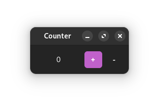
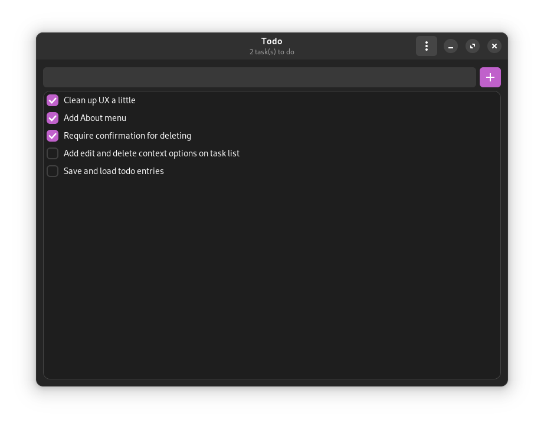

this is just a playground for learning nim_, gtk4_/libadwaita_, and owlkettle_

.. _nim: https://nim-lang.org
.. _gtk4: https://gtk.org
.. _libadwaita: https://gitlab.gnome.org/GNOME/libadwaita
.. _owlkettle: https://github.com/can-lehmann/owlkettle

counter
-------

owlkettle's counter demo, but with a decrement button

todo
----

owlkettle's todo tutorial, expanded a bit

